<!-- _class: cover -->

# SinalACS

Priorização clínica de visitas domiciliares na Atenção Primária à Saúde

Showcase — protótipo

<!--
Equipe / autoria: completar antes da apresentação final.
-->

---

<!-- _class: statement -->

# A doença não segue o mapa.

O Agente Comunitário de Saúde visita as casas na ordem do roteiro geográfico —
rua por rua, sempre igual. Quem está pior pode ser a última visita do dia,
simplesmente por morar no fim da rua.

---

<!-- _class: statement -->

# Sinais clínicos estruturados → fila ranqueada por risco

Uma triagem de três perguntas, com regra determinística inspirada no
Protocolo de Manchester — sem inteligência artificial, sem campo editável.
A mesma resposta produz sempre a mesma cor, de forma auditável.

  

    <h3>e-SUS APS</h3>
    
Registra o que já aconteceu.

  

  

    <h3>WhatsApp</h3>
    
Desorganiza — comunicação sem estrutura nem prioridade.

  

  

    <h3 style="color: var(--acs-text);">SinalACS</h3>
    
Prioriza, com regra fechada e reproduzível.

  

---

# Arquitetura em um slide

  

    <h3>3 apps Flutter</h3>
    
Paciente, ACS e Admin — isomorfismo Dart de ponta a ponta com o backend.

  

  

    <h3>Backend Dart/Serverpod</h3>
    
RPC tipado, ORM e migrações geradas — não é REST.

  

  

    <h3>PostgreSQL + MQTT/TLS</h3>
    
Persistência relacional e entrega de alerta com confirmação (ACK).

  

  

    <h3>Traefik</h3>
    
Reverse proxy/edge gateway para tráfego RPC e WebSockets do MQTT.

  

Offline-first: cache territorial em <code>sqflite</code> no app do ACS, com
sincronização em segundo plano assim que a rede volta.

---

  

    

      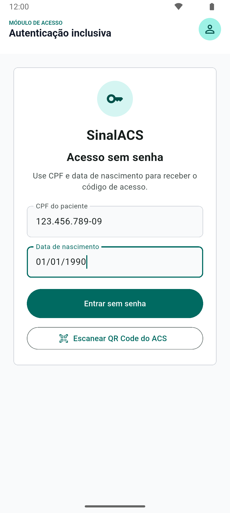
    

  

  

    <h2>Paciente — Autenticação inclusiva</h2>
    <ul>
      <li>Acesso com CPF e data de nascimento, sem senha</li>
      <li>Atalho de QR Code visível na tela (leitura ainda depende de integração)</li>
      <li>Pensado para baixo letramento digital: fricção mínima no primeiro acesso</li>
    </ul>
  

Paciente

---

  

    

      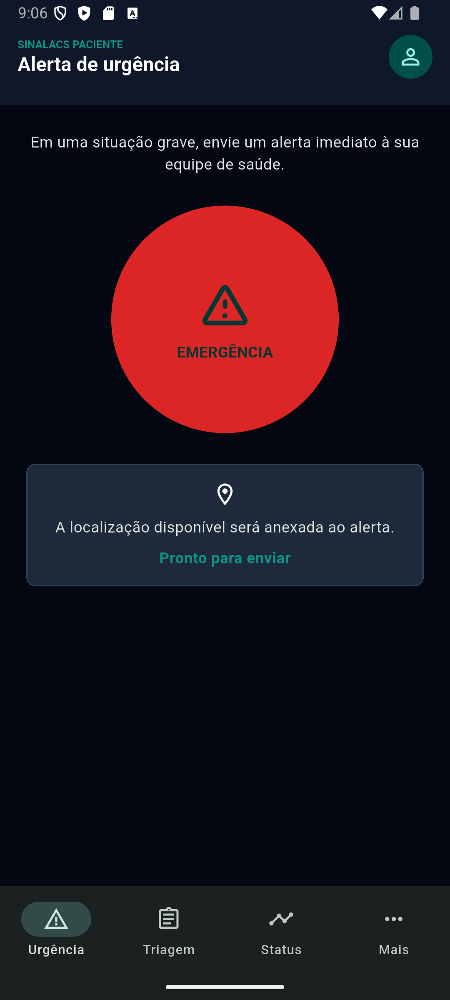
    

  

  

    <h2>Paciente — Alerta de urgência</h2>
    <ul>
      <li>Botão circular de emergência domina a hierarquia visual</li>
      <li>Confirmação explícita antes de qualquer mudança de estado</li>
      <li>O alerta é <strong>registrado e enfileirado</strong> — a entrega ponta a
        ponta com confirmação (ACK) é a prova técnica do próximo bloco</li>
    </ul>
  

Paciente

---

  

    

      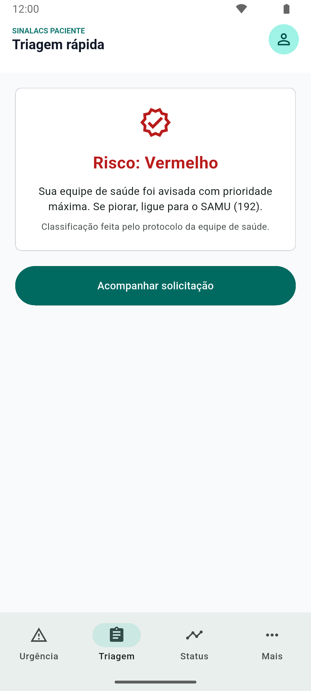
    

  

  

    <h2>Paciente — Triagem rápida</h2>
    <ul>
      <li>Três perguntas, uma resposta por vez, com indicador de progresso</li>
      <li>Classificação <strong>determinística</strong>, sem campo editável —
        nem para o paciente, nem para o ACS</li>
      <li>Mesma resposta → mesma cor, sempre. Regra fechada e auditável</li>
    </ul>
    
Risco: Vermelho

  

Paciente

---

<h2>Paciente — Acompanhamento, lembretes e meus dados</h2>

  <figure style="margin: 0; text-align: center;">
    

      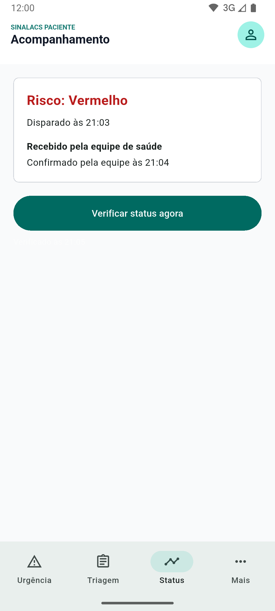
    

    <figcaption style="margin-top: 10px; font-size: 14px; color: var(--text-muted);">Status da solicitação</figcaption>
  </figure>
  <figure style="margin: 0; text-align: center;">
    

      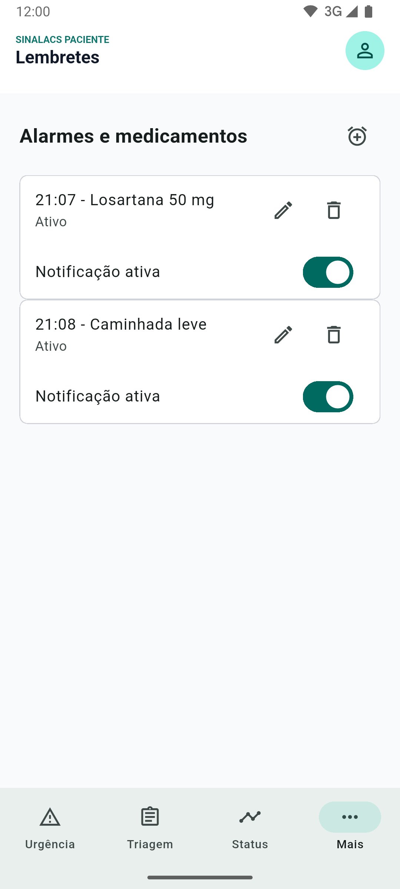
    

    <figcaption style="margin-top: 10px; font-size: 14px; color: var(--text-muted);">Lembretes</figcaption>
  </figure>
  <figure style="margin: 0; text-align: center;">
    

      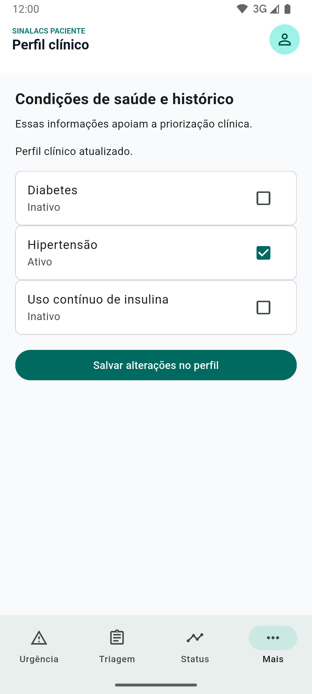
    

    <figcaption style="margin-top: 10px; font-size: 14px; color: var(--text-muted);">Perfil clínico · meus dados</figcaption>
  </figure>

Paciente

---

  

    

      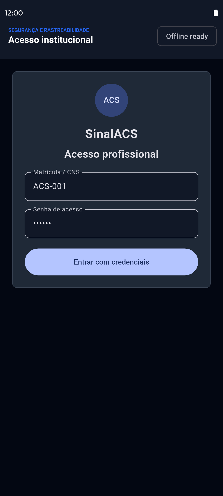
    

  

  

    <h2>ACS — Login institucional</h2>
    <ul>
      <li>Matrícula/CNS e senha, com indicador de operação offline</li>
      <li>Mesmo padrão visual do login do Admin</li>
      <li>Autenticação institucional real (SSO/gov.br) é passo seguinte do roadmap</li>
    </ul>
  

ACS

---

  

    

      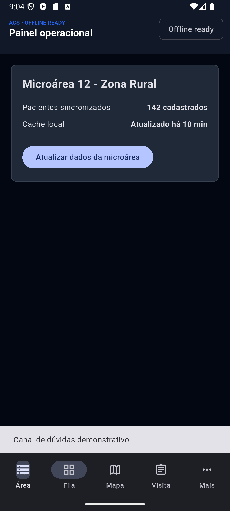
    

  

  

    <h2>ACS — Territorialização</h2>
    <ul>
      <li>Microárea, quantidade de pacientes e status do cache local</li>
      <li><strong>O ACS só acessa dados do próprio território</strong> —
        invariante do sistema, não uma configuração (INV-01)</li>
      <li>Cache territorial via <code>sqflite</code>, para operar sem rede</li>
    </ul>
  

ACS

---

  

    

      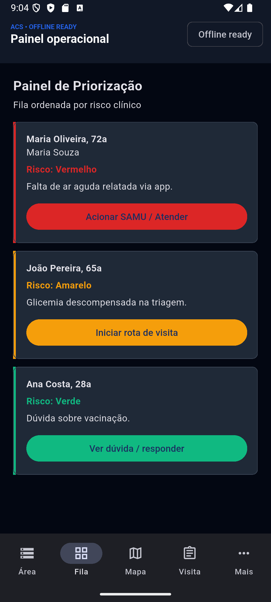
    

  

  

    <h2>ACS — Fila de priorização</h2>
    <ul>
      <li>Ordem por gravidade clínica: vermelho → amarelo → verde</li>
      <li>Cor é <strong>exclusiva</strong> da classificação de risco — avisos
        técnicos (sem conexão, falha ao salvar) usam azul, nunca vermelho/amarelo</li>
      <li>Falha transitória ganha botão "Tentar agora", mesmo com reconexão
        automática já em curso</li>
    </ul>
  

ACS

---

  

    

      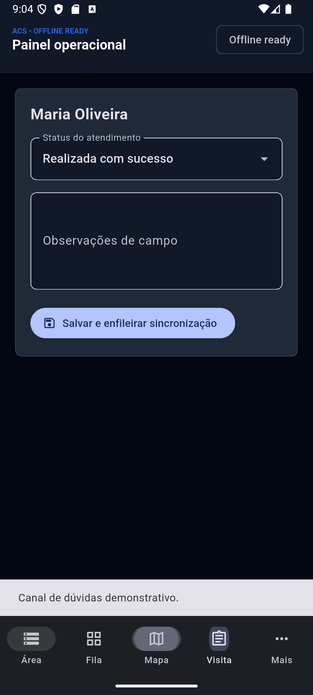
    

  

  

    <h2>ACS — Registro de visita offline</h2>
    <ul>
      <li>Desfecho e observações registrados na porta da casa, com ou sem sinal</li>
      <li>Enfileiramento local; sincronização automática ao voltar a rede</li>
      <li>Em zona rural, é a diferença entre ter o dado e perder o dia</li>
    </ul>
  

ACS

---

  

    

      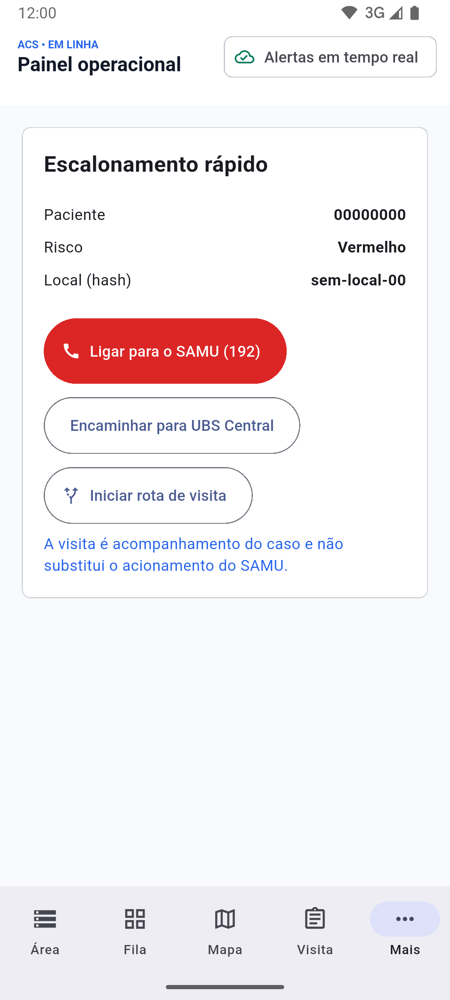
    

  

  

    <h2>ACS — Acionamento e escalonamento</h2>
    <ul>
      <li>Resume paciente, risco e endereço para acionar SAMU ou UBS</li>
      <li>Botões deixam explícito que discagem e encaminhamento reais ainda não
        estão integrados</li>
      <li>Integração SAMU roadmap</li>
    </ul>
  

ACS

---

  

    

      

        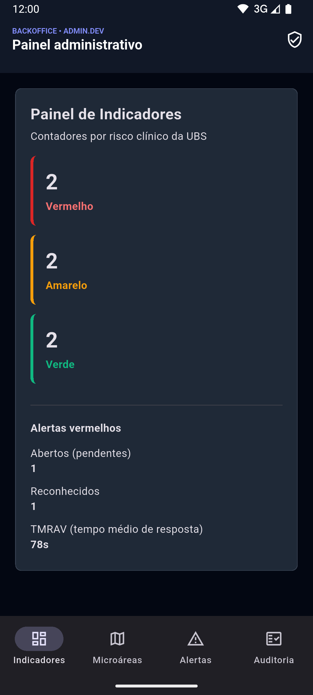
      

      

        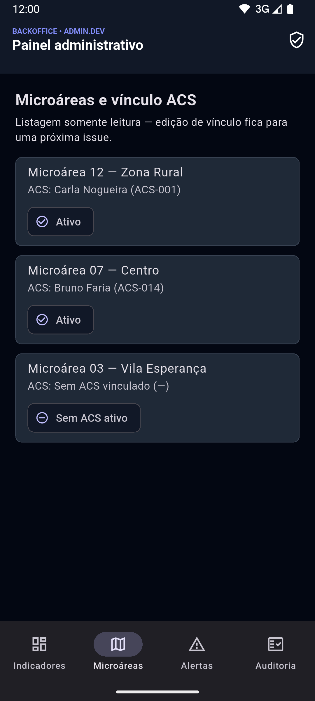
      

    

  

  

    <h2>Admin — Indicadores e microáreas</h2>
    <ul>
      <li>Contadores por risco, alertas abertos vs. reconhecidos e o TMRAV</li>
      <li>Listagem somente leitura das microáreas e do ACS vinculado</li>
      <li>Desktop-first: <code>NavigationRail</code> em telas largas,
        <code>NavigationBar</code> abaixo de 640px</li>
    </ul>
  

Admin

---

  

    

      

        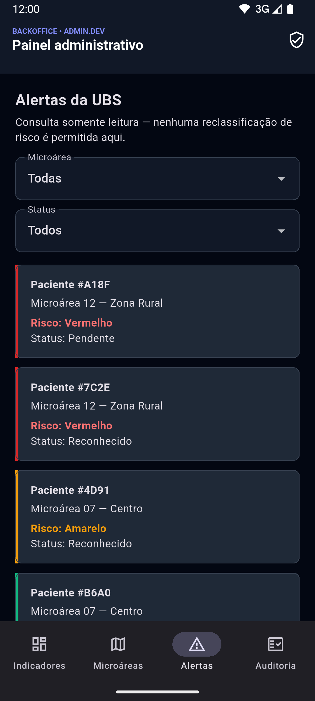
      

      

        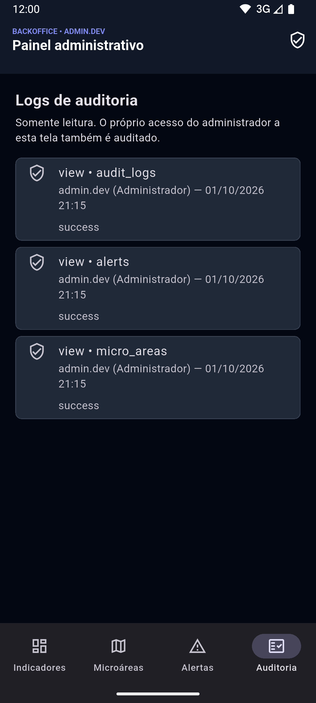
      

    

  

  

    <h2>Admin — Alertas, auditoria e layout responsivo</h2>
    <ul>
      <li>Alertas filtráveis por microárea e status — sem controle de
        reclassificação (a classificação não é alterável por humano, INV-02)</li>
      <li>Log de auditoria somente leitura; toda visita às telas sensíveis
        também é registrada</li>
      <li>Mesmo <code>ThemeData</code> se adapta de celular a tablet</li>
    </ul>
  

Admin

---

# Segurança e LGPD

  

    <h3>Dados sensíveis</h3>
    
Colunas clínicas criptografadas (AES-256/pgcrypto) em repouso e TLS em trânsito.

  

  

    <h3>Restrição por microárea</h3>
    
INV-01 reforçada no backend, não só na interface — um ACS nunca lê dados
      fora do próprio território.

  

  

    <h3>Trilha de auditoria</h3>
    
Acesso a dado sensível registrado com quem, quando e o quê — inclusive
      no backoffice Admin.

  

Conformidade LGPD documentada em <code>spec/lgpd_design.md</code>; análise de
cibersegurança baseada em NIST CSF 2.0 em <code>spec/security_assessment.md</code>.

---

# Estado atual e roadmap

Protótipo validado localmente — ciclo de alerta vermelho roda ponta a ponta
com confirmação de entrega, CI verde nos quatro trilhos.

  

    
Concluída

    <strong>Fase 1 — Prova de conceito</strong>
  

  

    
Concluída

    <strong>Fase 2 — Alpha/Beta</strong>
  

  

    
Em curso

    <strong>Fase 3 — Disponibilidade geral</strong>
    
Deploy monitorado, teste de
      carga e auditoria de conformidade LGPD

  

Mapa interativo, geofencing, integração SAMU e avisos push
roadmap v1.5 — hoje são stubs no protótipo,
não capacidades ativas.

---

<!-- _class: closing -->

# O pedido: um piloto controlado

  

1

UBS

  

2

microáreas

  

50

pacientes

Para medir a única métrica que importa: quanto tempo leva, hoje, até alguém
chegar em quem está pior.
alvo &lt; 90s (TMRAV)

SinalACS · github.com/hbgit/SinalACS · contato: completar antes da apresentação

