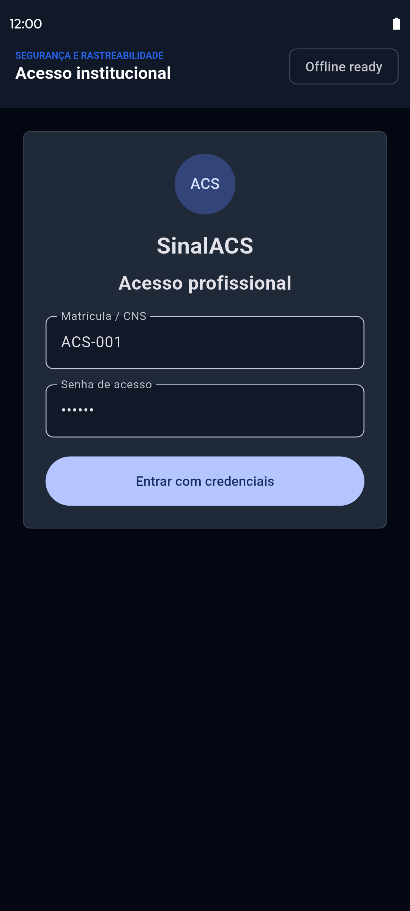
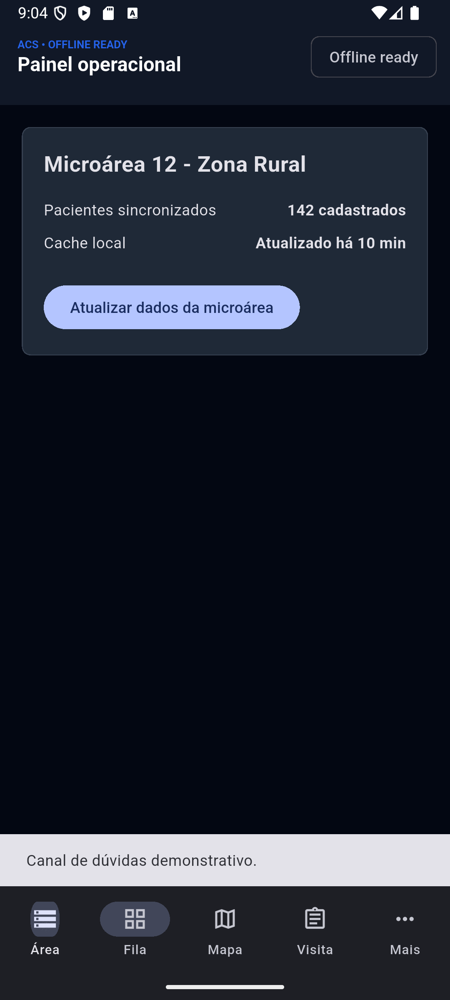
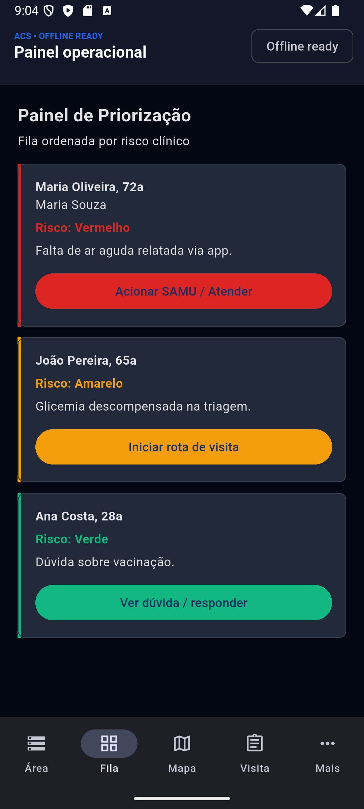
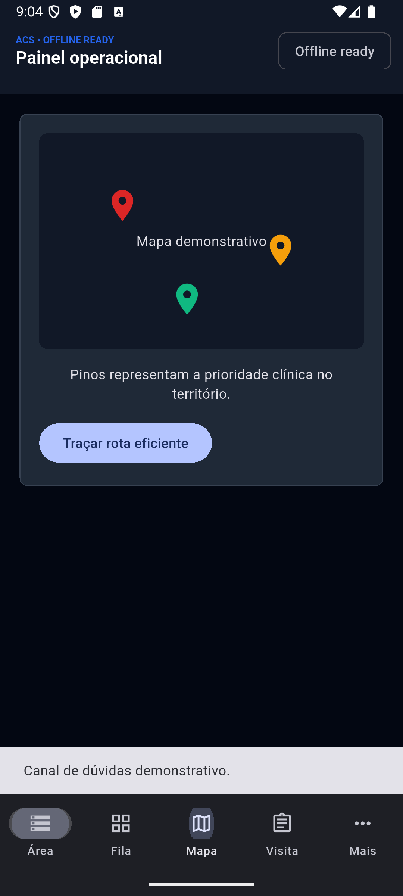
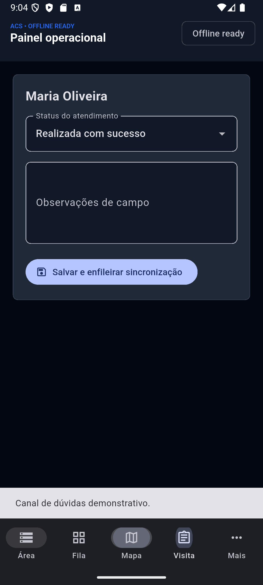

# Telas do App ACS

Documentação visual do protótipo Flutter do Agente Comunitário de Saúde. As imagens foram capturadas no emulador Android `sdk gphone64 x86 64` usando dados sintéticos.

## Navegação

A barra inferior dá acesso a **Área**, **Fila**, **Mapa** e **Visita**. O item **Mais** abre os destinos de **Acionamento**, **Geofencing** e **Avisos à comunidade**.

## Login institucional

A tela de entrada contém matrícula/CNS e senha, com indicador de operação offline. A autenticação é demonstrativa e não possui integração Gov.br ou servidor de identidade nesta etapa.

## Territorialização

Exibe a microárea, quantidade de pacientes e status do cache. A ação de atualização apresenta o estado de protótipo e não busca dados de uma API central.

## Dashboard de priorização

A fila apresenta os riscos vermelho, amarelo e verde com borda e ação contextual. A ordem mantém a prioridade clínica e a cor é reservada para a gravidade.

## Mapa de pacientes

Mostra pinos sintéticos conforme o risco e uma ação de rota. Não usa Google Maps nem calcula rota real nesta versão.

## Registro de visita

Permite escolher o desfecho, registrar observações e enfileirar a visita localmente. O registro usa a fila offline existente; sincronização central permanece pendente.

## Acionamento e escalonamento

Resume paciente, risco e endereço para ações de SAMU ou UBS. Os botões comunicam explicitamente que discagem e encaminhamento reais ainda não foram integrados.

## Geofencing

Exibe uma proximidade sintética e atalho para o formulário de visita. Rastreamento em segundo plano, permissões e geofencing real não fazem parte desta entrega.

## Avisos à comunidade

Permite preparar público-alvo e mensagem comunitária. O envio depende da futura integração FCM/APNs e das regras de segmentação por microárea.

## Referências

- [Implementação Flutter](../apps/acs/lib/app/app.dart)
- [Protótipos de referência](../spec/ui_acs)
- [Guia visual](../spec/ui_design.md)
