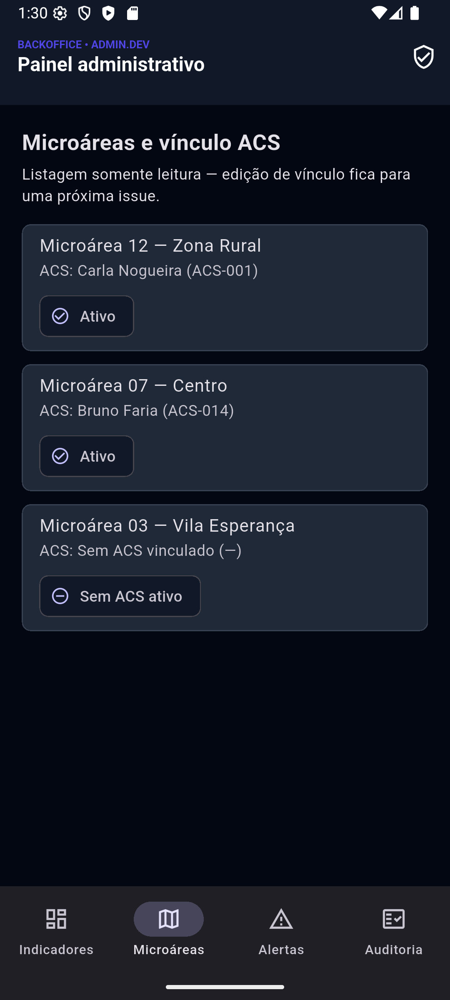
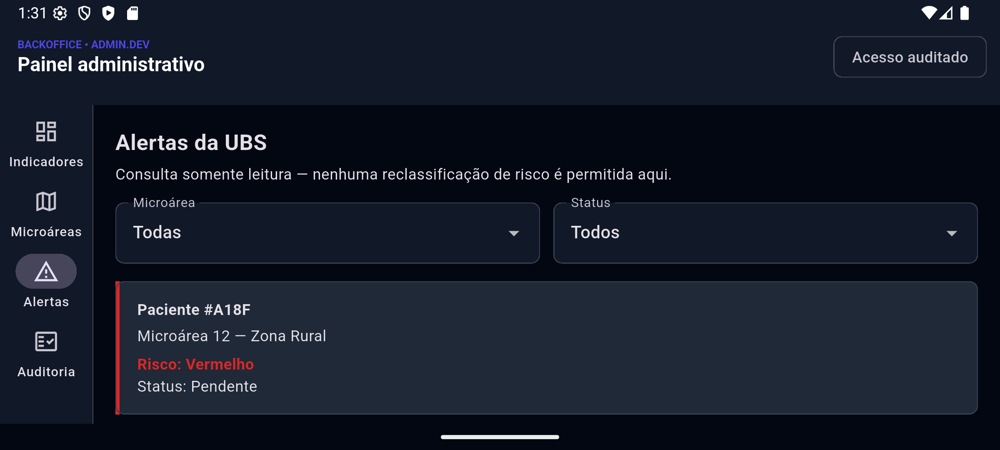
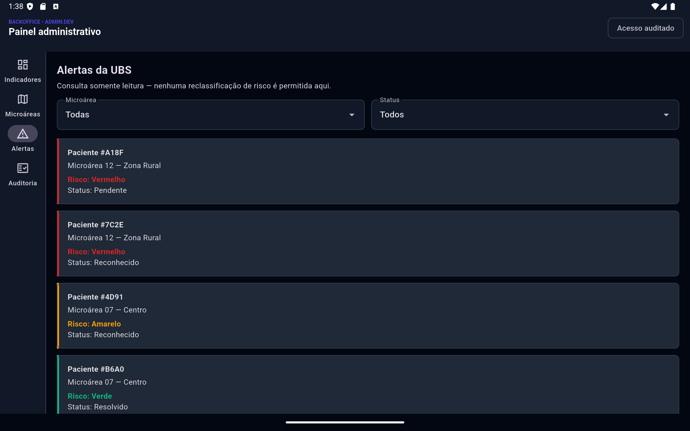

# Telas do Backoffice Admin

Documentação visual do protótipo Flutter do backoffice administrativo (`apps/admin`). Assim como `docs/telas-acs.md` e `docs/telas-paciente.md`, as imagens abaixo foram capturadas rodando o app com dados sintéticos: as cinco primeiras em Flutter Web (`flutter run -d web-server`), as da seção *Layout em celular* num emulador Android (`flutter run -d emulator-5554`).

## Navegação

O backoffice é desktop-first (`spec/PRD_system.md` §2.1): acima de `AdminBreakpoints.rail` (640dp) a navegação usa `NavigationRail` lateral; abaixo disso, `NavigationBar` inferior — mesmo `ThemeData`, só muda o container de navegação. Os quatro destinos são **Indicadores**, **Microáreas**, **Alertas** e **Auditoria**. Os pontos de quebra são constantes nomeadas em [`apps/admin/lib/app/admin_layout.dart`](../apps/admin/lib/app/admin_layout.dart).

## Login institucional (ambiente de desenvolvimento)

Formulário local (matrícula/CNS e senha pré-preenchidos, não validados — o botão avança independente do que está digitado) no mesmo padrão visual do login do ACS. Um banner fixo deixa explícito que não há autenticação institucional real (SSO/gov.br) nesta etapa.

Paciente e ACS já autenticam de verdade contra `auth.developmentLogin`; o admin não, porque esse endpoint hoje só aceita `role: patient` ou `role: acs` — não existe usuário fixo de desenvolvimento para `admin` (ver `backend/sinalacs_server/lib/src/endpoints/auth_endpoint.dart`). Ligar isso de verdade exige uma mudança no backend, fora do escopo desta issue.

## Painel de indicadores

Contadores por `RiskLevel` (vermelho/amarelo/verde), alertas vermelhos abertos vs. reconhecidos e o TMRAV (Tempo Médio de Resposta a Alerta Vermelho, a métrica North Star do PRD). Dados mockados atrás de `AdminDataSource`; cor usada exclusivamente como sinal clínico.

## Microáreas e vínculo ACS

Lista somente leitura das microáreas da UBS com o ACS vinculado e seu status. Edição de vínculo fica para uma issue futura, como definido no escopo.

## Alertas da UBS

Lista de alertas filtrável por microárea e status. Não há nenhum controle de reclassificação de risco — a classificação é determinística e não alterável por intervenção humana (INV-02 do PRD).

## Logs de auditoria

Log somente leitura. Toda visita às telas de Microáreas, Alertas e Auditoria registra uma entrada própria via `AdminDataSource.recordAccess`, simulando o requisito do PRD §4.2.2 de que o acesso do Administrador também é auditado.

## Layout em celular (Android)

O app roda em Android desde que a plataforma foi adicionada. Mobile é **complemento do desktop, não substituição**: o layout com rail continua sendo o padrão, e abaixo de `AdminBreakpoints.stacked` (480dp) o que mudaria de significado ao ser espremido passa a empilhar.

Em retrato: `NavigationBar` inferior com os quatro destinos; o selo "Acesso auditado" do cabeçalho vira ícone (mantendo o rótulo para leitores de tela, via `Semantics`); e o `Chip` de vínculo do ACS desce para baixo da descrição em vez de disputar largura com o título — antes, como `trailing` de um `ListTile`, "Sem ACS ativo" comia ~140dp dos ~320dp úteis.

Em paisagem o aparelho passa dos 640dp e o `NavigationRail` volta, junto com o chip e com os dois filtros de Alertas lado a lado. Sobram ~288dp de altura para quatro destinos rotulados: cabe por poucos pixels com fonte padrão e estoura a partir de ~150%, então o rail usa `scrollable: true`. A rotação preserva o destino e os filtros selecionados, porque o `AndroidManifest.xml` declara `configChanges` para `orientation` e `fontScale`.

Em tablet (AVD `Medium_Tablet`, 2560x1600) o layout é indistinguível do web: rail lateral, chip no cabeçalho, filtros lado a lado. É essa a checagem de que o desktop-first não regrediu ao ganhar o layout compacto.

Validado no emulador em retrato, paisagem, em tablet e com a fonte do sistema a 200% (WCAG 1.4.4), sem nenhum estouro de layout. A régua automatizada correspondente está em `apps/admin/test/responsive_layout_test.dart` e `text_scale_test.dart`; `apps/admin/integration_test/` repete o percurso no runtime real do Android e é **hermético** — não precisa da stack Docker, ao contrário dos apps ACS e do paciente.

## Referências

- [Implementação Flutter](../apps/admin/lib/app/app.dart)
- [Pontos de quebra e altura do cabeçalho](../apps/admin/lib/app/admin_layout.dart)
- [Camada de dados](../apps/admin/lib/core/data/admin_data_source.dart)
- [Protótipos de referência](../spec/ui_acs) (linguagem visual — não há protótipo HTML específico do admin ainda)
- [Guia visual](../spec/ui_design.md)
