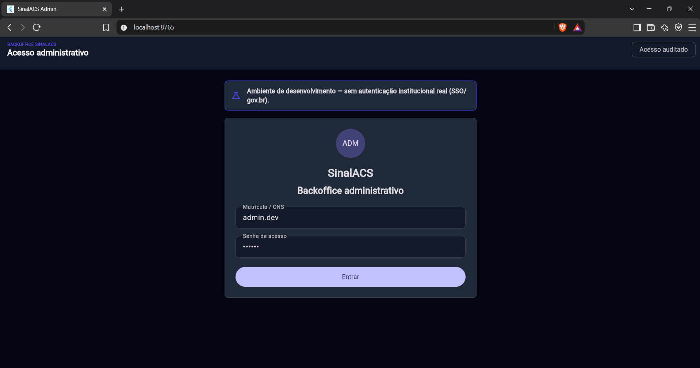
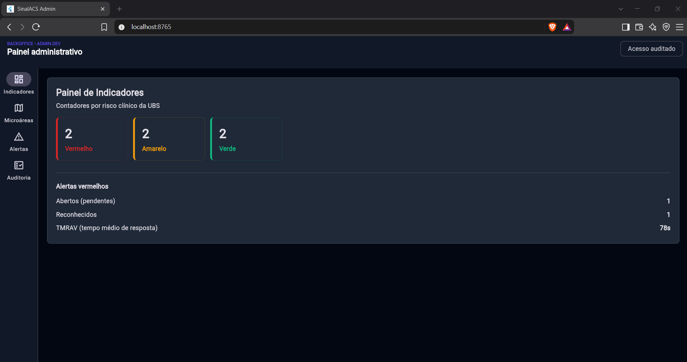
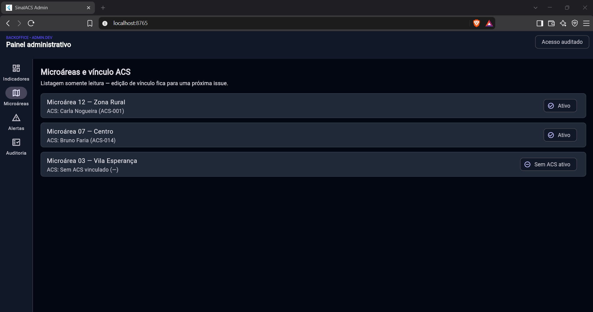
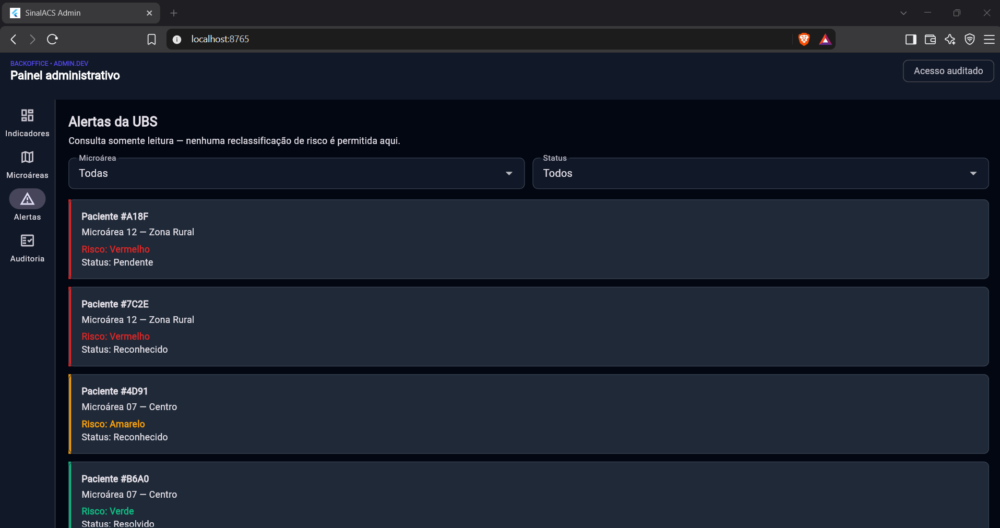
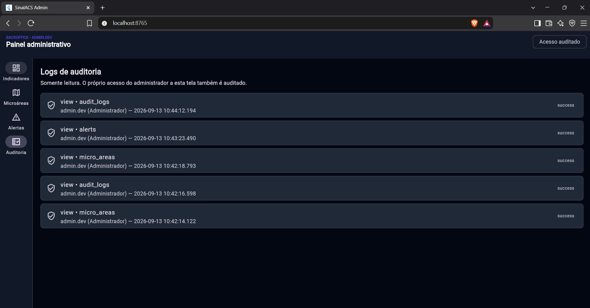

# Telas do Backoffice Admin

Documentação visual do protótipo Flutter do backoffice administrativo (`apps/admin`). Assim como `docs/telas-acs.md` e `docs/telas-paciente.md`, as imagens abaixo devem ser capturadas rodando o app (`flutter run -d chrome`, já que o alvo é Flutter Web) com dados sintéticos — **pendente nesta entrega**, ver observação no final.

## Navegação

O backoffice é desktop-first (`spec/PRD_system.md` §2.1): em telas ≥640px de largura a navegação usa `NavigationRail` lateral; abaixo disso, `NavigationBar` inferior — mesmo `ThemeData`, só muda o container de navegação. Os quatro destinos são **Indicadores**, **Microáreas**, **Alertas** e **Auditoria**.

## Login institucional (ambiente de desenvolvimento)

Formulário local com matrícula/CNS e senha, no mesmo padrão visual do login do ACS. Um banner fixo deixa explícito que não há autenticação institucional real (SSO/gov.br) nesta etapa — mesmo padrão dos apps de paciente e ACS, que também não chamam o backend hoje.

## Painel de indicadores

Contadores por `RiskLevel` (vermelho/amarelo/verde), alertas vermelhos abertos vs. reconhecidos e o TMRAV (Tempo Médio de Resposta a Alerta Vermelho, a métrica North Star do PRD). Dados mockados atrás de `AdminDataSource`; cor usada exclusivamente como sinal clínico.

## Microáreas e vínculo ACS

Lista somente leitura das microáreas da UBS com o ACS vinculado e seu status. Edição de vínculo fica para uma issue futura, como definido no escopo.

## Alertas da UBS

Lista de alertas filtrável por microárea e status. Não há nenhum controle de reclassificação de risco — a classificação é determinística e não alterável por intervenção humana (INV-02 do PRD).

## Logs de auditoria

Log somente leitura. Toda visita às telas de Microáreas, Alertas e Auditoria registra uma entrada própria via `AdminDataSource.recordAccess`, simulando o requisito do PRD §4.2.2 de que o acesso do Administrador também é auditado.

## Pendência desta entrega

As screenshots reais ainda não foram capturadas nesta máquina de desenvolvimento — ver descrição do PR para o motivo e o plano de captura.

## Referências

- [Implementação Flutter](../apps/admin/lib/app/app.dart)
- [Camada de dados](../apps/admin/lib/core/data/admin_data_source.dart)
- [Protótipos de referência](../spec/ui_acs) (linguagem visual — não há protótipo HTML específico do admin ainda)
- [Guia visual](../spec/ui_design.md)
