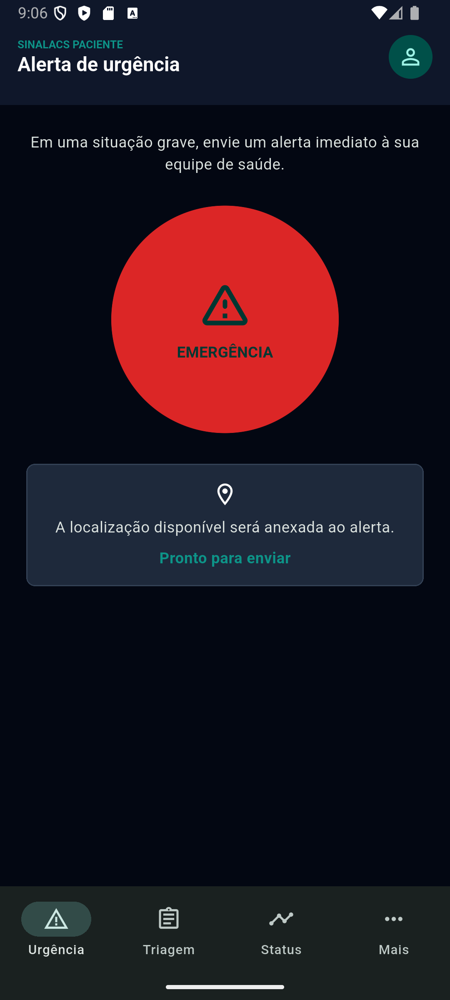

# Telas do App Paciente

Documentação visual do protótipo Flutter do paciente. As imagens foram capturadas no emulador Android `sdk gphone64 x86 64` usando somente dados sintéticos.

## Navegação

Os destinos principais são **Urgência**, **Triagem** e **Status**. O item **Mais** reúne **Dúvidas**, **Perfil clínico** e **Lembretes**.

## Autenticação inclusiva

A tela inicial apresenta CPF, data de nascimento, entrada sem senha e acesso de QR Code. O fluxo atual encaminha diretamente para a triagem; OTP e leitura de QR Code ainda dependem de integração.

## Alerta de urgência

O botão circular de emergência possui confirmação antes de alterar o estado local. A tela informa que a localização disponível será incluída. Nesta fase, o alerta é um estado local demonstrativo: MQTT, geolocalização real e confirmação de entrega ainda não estão conectados.

## Triagem rápida

Fluxo de três perguntas com indicador de progresso e uma alternativa por etapa. A classificação é determinística e não pode ser editada pela pessoa usuária. Ao finalizar, encaminha para o acompanhamento da solicitação.

## Canal de dúvidas

Exibe conversa local e permite adicionar mensagens. A resposta para campanhas de vacinação é demonstrativa; não há mensageria remota nesta etapa.

## Perfil clínico

Permite marcar condições crônicas e mostra o estado ativo ou inativo de cada condição. As alterações ficam apenas no estado do protótipo; a persistência segura será ligada à camada criptografada em uma etapa posterior.

## Acompanhamento de solicitação

Apresenta a linha do tempo `Enviado`, `Visualizado`, `Em análise` e `Agendado`, acompanhada de risco e atualização de exemplo da equipe ACS. Os dados são locais e sintéticos.

## Lembretes

Lista lembretes de medicamentos e de rotina, com controles de ativação. A criação e o agendamento de notificações do sistema ainda não foram integrados.

## Referências

- [Implementação Flutter](../apps/patient/lib/app/app.dart)
- [Protótipos de referência](../spec/ui_paciente)
- [Guia visual](../spec/ui_design.md)
