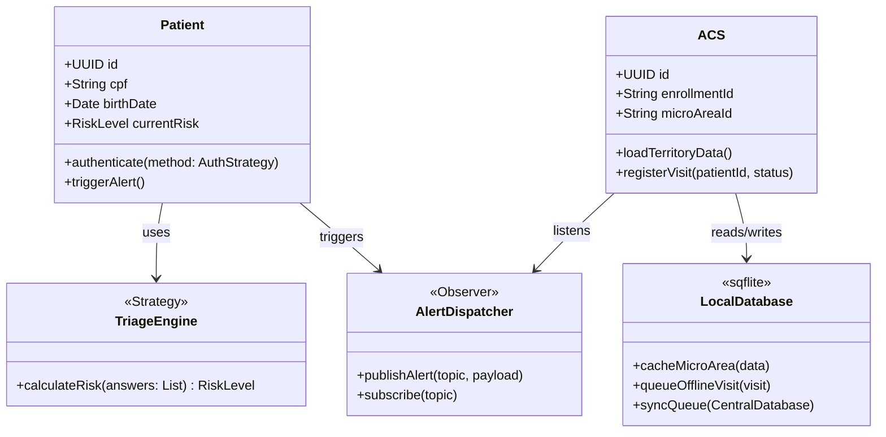
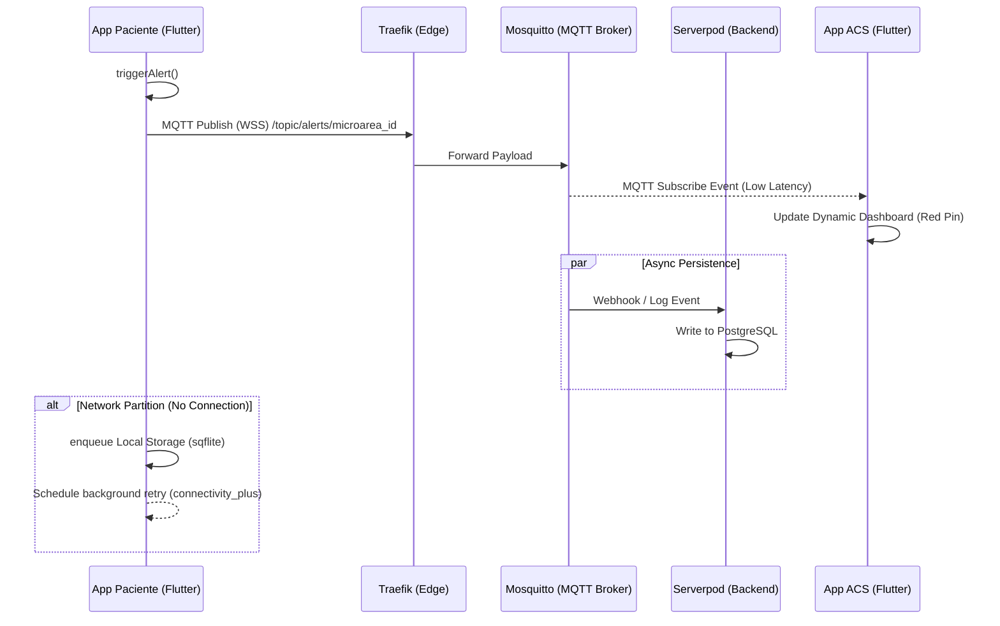
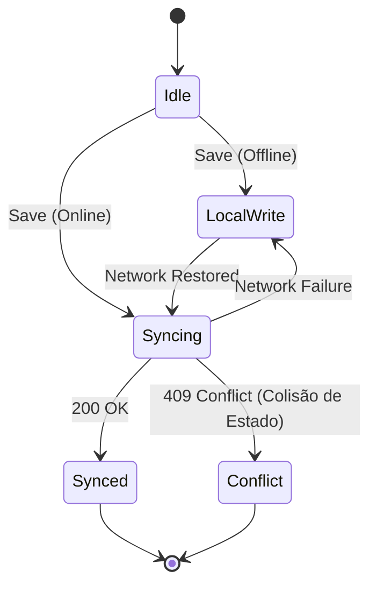

# Especificação Técnica de Arquitetura (SinalACS)

## 1. Análise de Requisitos e Domínio

**Resumo Executivo:**
O SinalACS atua como uma plataforma bidirecional de triagem e otimização para a Atenção Primária à Saúde. A solução resolve a ineficiência do modelo de roteamento geográfico estático, substituindo-o por uma fila de trabalho dinâmica e orientada a risco clínico determinístico (inspirado no Protocolo de Manchester). O diferencial arquitetural (Moat) baseia-se em uma topologia *offline-first* com isomorfismo Dart (Flutter e Serverpod), garantindo resiliência em zonas de sombra de rede.

### Matriz de Requisitos (RF e RNF)

| ID | Tipo | Descrição | Critérios Técnicos de Aceite |
| --- | --- | --- | --- |
| RF01 | Funcional | Módulo de Autenticação *Passwordless* para Pacientes.| Acesso via CPF e Data de Nascimento validados por SMS/OTP, biometria ou QR Code gerado pelo ACS.|
| RF02 | Funcional | Botão de Alerta de Urgência em Tempo Real.| Disparo de alerta com geolocalização exata transmitido via protocolo MQTT.|
| RF03 | Funcional | Formulário de Triagem Estruturada.| Matriz algorítmica fechada que retorna classificação determinística (Vermelho, Amarelo, Verde).|
| RF04 | Funcional | Territorialização e Cache de Dados (ACS).| Download exclusivo dos dados da Microárea do ACS para persistência local via `sqflite`.|
| RF05 | Funcional | Registro Rápido de Visitas *Offline-First*.| Cadastro da visita em base local com sincronização automática em *background* via conectividade reestabelecida.|
| RNF01 | Não-Funcional | Baixo consumo e latência na mensageria.| Utilização do Eclipse Mosquitto (MQTT) como broker central.|
| RNF02 | Não-Funcional | Roteamento e Proteção de Borda.| Traefik atuando como Reverse Proxy e Edge Gateway (REST/gRPC e WebSockets).|
| RNF03 | Não-Funcional | Implantação e Infraestrutura como Código (IaC).| Provisionamento automatizado via Pulumi utilizando TypeScript em VPS robustas.|

### Fronteiras de Domínio (Context Mapping)

* **Atores Oativos:** Paciente (App Paciente, *low-literacy UX*), Agente Comunitário de Saúde (App ACS, *dashboard* dinâmico).

* **Fronteiras de Sistema:** Cliente Flutter (dispositivo móvel), Edge/Proxy (Traefik), Backend API (Serverpod), Broker IoT (Mosquitto), e Banco de Dados (PostgreSQL).

---

## 2. Modelagem Estrutural (UML e Componentes)

A arquitetura adota um padrão de decomposição onde o estado efêmero de sincronização (isomorfismo Dart) encapsula a complexidade relacional. O design aplica o padrão *Strategy* para os algoritmos de cálculo de risco e *Observer* no *broker* MQTT.

### Decomposição de Módulos e Acoplamento

* **Módulo de Triagem (Frontend):** Acoplamento aferente nulo. Motor determinístico sem dependência de IO externo.

* **Módulo de Sincronização (Backend/Client):** Alto acoplamento eferente com a base local (`sqflite`) e central (`PostgreSQL`) devido à natureza de um ORM autogerado pelo Serverpod.

---

## 3. Dinâmica e Comportamento do Sistema

O diagrama abaixo ilustra a coreografia assíncrona do "Caminho Feliz" durante um alerta de urgência operando sob conexões instáveis.

**Fluxo Operacional Detalhado:**

1. **Caminho Feliz:** Paciente aciona alerta vermelho. O payload viaja pelo túnel TCP/WebSocket mantido pelo Mosquitto. O aplicativo do ACS recebe a interrupção de hardware (push), reordenando o *Dashboard* dinâmico.

2. **Tratamento de Exceções (Sombra de Rede):** Se o envio direto falhar (Timeout ou `SocketException`), a requisição entra no *ring buffer* do banco `sqflite` local. A biblioteca `connectivity_plus` escuta eventos do SO; ao detectar rede, dispara a fila em ordem cronológica (FIFO).

---

## 4. Modelagem Formal de Estados (FSM)

Para a máquina de estados do módulo de sincronização (risco crítico), modelamos o autômato finito determinístico (DFA).

**Definição Formal do Autômato $A = (Q, \Sigma, \delta, q_0, F)$:**

* $Q = \{S_{Idle}, S_{LocalWrite}, S_{Syncing}, S_{Conflict}, S_{Synced}\}$
* $\Sigma = \{e_{save}, e_{online}, e_{offline}, e_{ack}, e_{fail}\}$
* $q_0 = S_{Idle}$
* $F = \{S_{Synced}, S_{Conflict}\}$

**Matriz de Transição de Estados:**

| Estado Atual ($Q_n$) | Evento ($\Sigma$) | Guarda ($G$) | Ação ($A$) | Próximo Estado ($Q_{n+1}$) |
| --- | --- | --- | --- | --- |
| $S_{Idle}$ | `Salvar Visita` | `Net == false` | Inserir no `sqflite` | $S_{LocalWrite}$ |
| $S_{Idle}$ | `Salvar Visita` | `Net == true` | Enviar API Serverpod | $S_{Syncing}$ |
| $S_{LocalWrite}$ | `Rede Detectada` | `Fila > 0` | Iniciar *Background Sync* | $S_{Syncing}$ |
| $S_{Syncing}$ | `Timeout/Falha` | `Retry < Max` | *Exponential Backoff* | $S_{LocalWrite}$ |
| $S_{Syncing}$ | `200 OK` | `Hash == Match` | *Commit* Local | $S_{Synced}$ |
| $S_{Syncing}$ | `409 Conflict` | `Version < DB` | Marcar Revisão Manual | $S_{Conflict}$ |

**Análise de *Safety* e *Liveness*:**

* **Liveness (Vivacidade):** Há risco de *starvation* no estado $S_{LocalWrite}$ se a rede 3G oscilar perpetuamente sem fechar o *handshake* TCP. Mitigação: Compressão de pacotes e tolerância elevada a retardo.
* **Safety (Segurança):** O risco mais grave mapeado é a colisão de estado nas sincronizações. Exemplo: ACS altera dados *offline* que já foram modificados no `PostgreSQL` central.

---

## 5. Regras de Negócio e Lógica Proposicional

* **Invariante de Isolamento:** $\forall x \in Pacientes$, $ACS(y)$ tem permissão de leitura em $x \iff MicroArea(x) = MicroArea(y)$.

* **Invariante de Prioridade:** As exibições na interface do ACS devem garantir a relação estrita: $Weight(Vermelho) > Weight(Amarelo) > Weight(Verde)$.

* **Políticas de Consistência:**
* O dispositivo móvel opera sob consistência **BASE** (*Basically Available, Soft state, Eventual consistency*), garantindo a alta disponibilidade exigida para o registro *offline*.

* O banco central (`PostgreSQL` via Serverpod) opera sob **ACID** para a verdade absoluta dos dados (SSOT).

---

## 6. Análise de Risco e Robustez (Caos)

* **Ponto Único de Falha (SPOF):** O `Traefik` atua como roteador exclusivo para todos os serviços. Uma falha nesse *container* torna o cluster `Serverpod` e o *broker* `Mosquitto` inalcançáveis simultaneamente.

* **Mitigação (Circuit Breaker & Retry):** Transações `PostgreSQL` limitadas por *timeouts* estritos. Injeção de *Jitter* nos retentativas de sincronização dos clientes para evitar o *Thundering Herd Problem* (DDoS acidental quando todos os dispositivos ACS restabelecem o sinal de rede ao chegarem à UBS).
* **Observabilidade:** Geração de *logs* estruturados no cliente para rastrear desvios da matriz do Protocolo de Manchester (auditoria clínica) e rastreamento de UUID das mensagens MQTT para garantir garantia *At-Least-Once* da entrega.

---

## 7. Recomendações de Evolução Arquitetural

* **Escalabilidade Horizontal:** Como o `Serverpod` foi escolhido para o *backend* acoplado ao `PostgreSQL`, a escalabilidade passa por rodar múltiplas réplicas efêmeras dos servidores Dart balanceadas pelo `Traefik`, enquanto o banco relacional escalará verticalmente durante a fase MVP.

* **Gestão de Débito Técnico:** A dependência em um motor customizado para sincronizar o banco local com o remoto é identificada como o elo mais fraco da arquitetura. A longo prazo, se os conflitos de versão aumentarem, o sistema precisará refatorar pesadamente os tipos de dados básicos para CRDTs (*Conflict-free Replicated Data Types*) em vez de manter uma lógica manual frágil.
