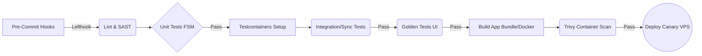

A arquitetura do SinalACS apresenta um desafio de engenharia fascinante: conciliar a latência ultrabaixa de alertas críticos (via MQTT) com a resiliência assíncrona de um sistema *offline-first* distribuído em zonas de sombra de rede. Como o projeto utiliza Dart tanto no cliente (Flutter) quanto no backend, a estratégia de DevSecOps e Quality as Code (QaC) deve explorar essa homogeneidade para unificar pipelines, mitigar colisões de estado e garantir a segurança dos dados clínicos na borda (*edge*).

---

## 1. Arquitetura de Testes e Estratégia de Validação

Para otimizar o *Lead Time* e erradicar testes *flaky*, a pirâmide de testes tradicional deve ser invertida e adaptada para uma topologia *offline-first*.

* **Testes de Unidade (70%):** Foco implacável no Motor de Triagem e na Máquina de Estados (FSM) de sincronização. Como o algoritmo de Manchester é determinístico, ele deve ter 100% de cobertura (MCDC - *Modified Condition/Decision Coverage*).


* **Testes de Integração Epêmeros (20%):** Validação do banco de dados local (`sqflite`) e da camada de persistência em PostgreSQL. Utilizaremos **Testcontainers** na esteira CI para provisionar instâncias efêmeras do PostgreSQL e do Mosquitto idênticas à produção.


* **Testes E2E (10%):** Focados apenas nos Caminhos Críticos (ex: Disparo do Botão de Alerta e Cache de Territorialização).


* **Contratos Orientados a Eventos:** A ausência de um ORM/codegen no backend (decisão original de usar Serverpod não foi implementada) significa que não há hoje quebra de compilação automática em falhas de contrato REST — isso é um risco a mitigar, não uma garantia existente. O risco real está na mensageria assíncrona. Implementaremos validação de contratos **AsyncAPI** para os *payloads* do *broker* Mosquitto, garantindo que o publicador (Paciente) e o consumidor (ACS) falem a mesma linguagem sem corromper o *buffer* de mensagens.


## 2. Engenharia de Qualidade (TDD e BDD)

A complexidade algorítmica exige rigor matemático e previsibilidade.

* **TDD na Máquina de Estados (FSM):** O ciclo *Red-Green-Refactor* será aplicado para validar o autômato finito determinístico da sincronização. Devemos escrever testes que forcem as transições entre os estados $S_{LocalWrite}$ e $S_{Syncing}$ simulando partições de rede (`SocketException`) para garantir que não ocorra *starvation* na fila do dispositivo. A aplicação de métodos formais leves (*model checking*) nesta FSM garantirá a vivacidade e segurança estrutural do sincronismo de dados críticos.


* **App Actions em vez de Page Objects:** Para reduzir a fragilidade dos testes E2E no Flutter, aboliremos a navegação puramente baseada em cliques de UI. Utilizaremos **App Actions**, injetando e manipulando estados diretamente via `riverpod` para levar o aplicativo ao estado desejado (ex: forçar o estado de "alerta vermelho recebido") e testar apenas a renderização final.


* **Test Data Management (TDM):** Scripts de *seeding* devem gerar bancos SQLite criptografados pré-populados com cenários de "crônicos descompensados" e "conflitos de versão" (ex: registros locais desatualizados em relação ao SSOT do PostgreSQL).


## 3. UX, UI e Acessibilidade (Shift-Left)

A interface deve ser impecável sob estresse e operável por usuários com baixo letramento digital.

* **Regressão Visual (Golden Tests):** Em vez de ferramentas SaaS caras na fase MVP, utilizaremos *Golden Tests* nativos do Flutter integrados à pipeline. Qualquer alteração de pixel no *Dashboard de Priorização* ou na paleta restrita do *Dark Mode* quebrará o *build*.


* **Acessibilidade Automatizada:** O pacote `accessibility_test` será acoplado aos *Golden Tests* para validar, em tempo de CI, se os alvos de toque (botão de pânico) atendem ao mínimo de 48x48 dp exigido pelo WCAG 2.1 Nível AA e se o contraste das cores de alerta (Vermelho, Amarelo, Verde) está adequado.


## 4. Estratégia de Segurança (SSDLC e OWASP)

O tratamento de dados clínicos e PII (LGPD) em dispositivos de borda (*Edge IoT*) requer defesa em profundidade.

* **Criptografia em Repouso na Borda (Crítico):** O uso padrão do `sqflite` armazena dados em texto claro. É obrigatória a substituição pelo **SQLCipher** para criptografar o banco local. O roubo do celular do ACS não pode resultar em vazamento da base territorial.


* **Modelagem de Ameaças (STRIDE):** O vetor mais sensível é o *broker* Mosquitto. A injeção de mensagens falsas (Spoofing) no tópico `/alerts/microarea_id` pode gerar ataques de negação de serviço (DoS) operacional nas UBSs.


* **SAST e SCA Integrados:** Uso do `dart analyze` com regras customizadas restritas e **Trivy** no CI para escanear vulnerabilidades em dependências de terceiros e nas imagens Docker do Traefik, Mosquitto e PostgreSQL.


* **Hardening de Infraestrutura e IoT:** O MQTT deve operar exclusivamente sobre TLS (MQTTS via WebSockets no Traefik). Os *containers* do backend e Postgres não devem expor portas públicas, operando em redes virtuais isoladas no Pulumi. (Roadmap de produção — na stack de desenvolvimento atual a porta do backend é publicada diretamente, sem isolamento de rede.)


## 5. Pipeline DevSecOps e Observabilidade

A esteira de integração contínua deve ser paranoica e atuar como o portão de qualidade absoluto.



* **Métricas DORA e Justificativa Econômica:** Automatizar o *Quality Gate* reduz drasticamente a Taxa de Falha em Mudanças (*Change Failure Rate*). O ROI é imediato: falhas de sincronização na atenção primária geram retrabalho clínico em papel, destruindo a adoção do sistema pelos ACS. A automação garante o "custo do erro" próximo a zero em produção.
* **Observabilidade e Resiliência:** Implementação de **OpenTelemetry** no backend para gerar *traces* distribuídos. No aplicativo Flutter, os *logs* estruturados de falha no MQTT ou colisões de estado serão armazenados localmente e escoados para o servidor assim que houver rede, injetando *Jitter* no *backoff* exponencial para evitar o *Thundering Herd Problem*.


### Exemplo de Automação Híbrida (Testcontainers): `.github/workflows/ci.yml`

> Ilustrativo — não implementado como mostrado abaixo (não existe `docker-compose.test.yml` nem os caminhos de teste citados). Ver [`.github/workflows/ci.yml`](../.github/workflows/ci.yml) para o pipeline real (4 jobs: `backend`, `backend-docker-build`, `patient-app`, `acs-app`) e [`backend/DEPLOY.md`](../backend/DEPLOY.md) para o runbook de deploy real.

```yaml
name: SinalACS CI Pipeline
on: [push, pull_request]

jobs:
  test_and_analyze:
    runs-on: ubuntu-latest
    steps:
      - uses: actions/checkout@v3
      
      - name: Setup Dart and Flutter
        uses: subosito/flutter-action@v2
        
      - name: Spin up Ephemeral Infrastructure
        run: docker-compose -f docker-compose.test.yml up -d postgres mosquitto
        
      - name: Run SAST & Linter
        run: dart analyze --fatal-infos
        
      - name: Execute Deterministic FSM Tests
        run: flutter test test/domain/sync_fsm_test.dart
        
      - name: Execute Database Sync Integration Tests
        run: dart test test/integration/serverpod_sync_test.dart

      - name: Verify UI via Golden Tests
        run: flutter test --update-goldens test/ui/dashboard_golden_test.dart

```

## 6. Diagnóstico e Plano de Ação

### Matriz de Risco (Top 3 Ameaças)

| Ameaça / Vulnerabilidade | Impacto | Probabilidade | Estratégia de Mitigação Arquitetural |
| --- | --- | --- | --- |
| **1. Vazamento de PII no Dispositivo (Edge)** | Crítico (LGPD) | Alta | Substituição imediata do `sqflite` nativo por SQLite criptografado (SQLCipher) com chave gerada pelo TEE do hardware. |
| **2. Colisão de Estado de Sincronização** | Alto | Alta | Versionamento estrito das linhas no PostgreSQL. Se o cliente tentar *commit* com versão inferior ($Version < DB$), forçar resolução manual na UBS.|
| **3. SPOF no Edge Gateway (Traefik)** | Crítico | Baixa | Implantação de instâncias redundantes do Traefik balanceadas via IP flutuante ou DNS *Round-Robin* no Pulumi.|

### Roadmap de Implementação

* **Semana 1 (Crítico - Fundação DevSecOps):** Implementação da pipeline CI (Mermaid acima), configuração do analisador estático Dart, criptografia SQLCipher no cache local e *Golden Tests* para o *Dark Mode*.
* **Mês 1 (Estrutural - Testes e Resiliência):** Setup do Testcontainers para validar integração do backend. Implementação de TDD cobrindo 100% das transições da FSM e do algoritmo de Manchester.
* **Trimestre 1 (Otimização - IA e CRDTs):** Pesquisa e prototipação de migração da sincronização customizada para CRDTs (*Conflict-free Replicated Data Types*) em preparação para a v1.5. Deploy de ferramentas DAST (OWASP ZAP) e painéis de observabilidade baseados no OpenTelemetry.

---

# Dependência de um motor de sincronização customizado

O calcanhar de Aquiles técnico deste MVP. A resiliência do túnel MQTT para os alertas de urgência é, sem dúvida, o vetor de tempo real mais crítico desta arquitetura. Em sistemas ciberfísicos e aplicações de borda (*Edge IoT*), a conectividade nunca é binária (ligada/desligada); o verdadeiro perigo reside nas partições de rede intermitentes, alta latência e *jitter* típicos de conexões 3G em áreas rurais ou periféricas.

## 1. Topologia de Conexão e Garantias de Entrega (QoS)

A configuração do cliente Dart (`mqtt_client`) e do Mosquitto deve ser tratada como infraestrutura imutável e testada como tal.

* **Sessões Persistentes (`clean_session = false`):** É mandatório que o cliente do ACS se conecte com um `client_id` fixo e a flag `clean_session` definida como falsa. O plano de teste deve validar se, ao desconectar o ACS e o Paciente disparar um alerta, o Mosquitto retém a mensagem no tópico `/alerts/microarea_id` e a entrega imediatamente no momento da reconexão.


* **Contrato At-Least-Once (QoS 1):** O nível de Qualidade de Serviço 1 garante a entrega, mas não impede a duplicidade. O teste de integração deve verificar a idempotência no frontend do ACS: se o *broker* reenviar o mesmo *payload* (mesmo UUID), o aplicativo não pode duplicar o marcador vermelho no mapa interativo.


* **Keep-Alive e LWT (Last Will and Testament):** A pipeline deve testar a morte súbita do aplicativo do Paciente. O Mosquitto deve emitir um LWT informando ao backend que o dispositivo parou de reportar telemetria.

## 2. Engenharia de Caos com Toxiproxy

> Ilustrativo — não implementado. O Toxiproxy e o `docker-compose.test.yml` abaixo não existem no repositório atual; a simulação de caos de rede hoje é feita client-side, em `apps/acs/lib/core/services/network_chaos_simulator.dart` (ver `apps/acs/test/network_chaos_test.dart`), sem integração com a esteira CI.

Não podemos confiar em testes que apenas desligam a interface de rede do emulador. Utilizaremos o **Toxiproxy** (criado pelo Shopify) integrado ao `docker-compose` da esteira CI para manipular o túnel TCP entre o aplicativo Flutter e o Traefik/Mosquitto.

* **Simulação de Latência e Jitter:** Injeção de atrasos randômicos (ex: 2000ms $\pm$ 500ms) para validar se o `ping` do MQTT falha graciosamente e não trava a *UI Thread* do Flutter.
* **Teste de *Thundering Herd*:** Simulação de um corte de rede massivo na UBS seguido de uma restauração abrupta. Validaremos se a injeção de *Jitter* no *Backoff Exponencial* do algoritmo de reconexão impede que dezenas de instâncias do app do ACS executem ataques DDoS acidentais contra o *Edge Gateway*.


## 3. Verificação Formal da Máquina de Estados (FSM)

A lógica que gerencia o túnel MQTT no Flutter é uma Máquina de Estados Finita (FSM). Para garantir a ausência de *deadlocks* (ex: o app acredita estar conectado, mas o *socket TCP* foi descartado pelo Traefik), aplicaremos testes que validam invariantes estruturais, inspirando-nos em métodos de verificação formal de *software*:

* **Invariante de Publicação:** O sistema deve provar logicamente a condição: $\text{Fila Local} \neq \emptyset \land \text{Sinal de Rede Activo} \implies \text{Tentativa de Publicação MQTT}$.
* **Isolamento de Falha (`SocketException`):** Testes unitários puros devem injetar interrupções de hardware (I/O) diretas no `riverpod` para assegurar que a transição de estado force a persistência do alerta vermelho no banco `sqflite` (estado de *fallback*) em menos de 16 milissegundos, evitando perda de dados caso o sistema operacional mate o aplicativo por falta de memória.


## 4. Implementação Prática (CI/CD)

Abaixo está o recorte da infraestrutura efêmera para testar as quedas de rede na pipeline, introduzindo o Toxiproxy à *stack* original:

```yaml
# docker-compose.test.yml (Excerto para Engenharia de Caos)
version: '3.8'
services:
  mosquitto:
    image: eclipse-mosquitto:2
    ports:
      - "1883:1883"
    networks:
      - test_net

  toxiproxy:
    image: ghcr.io/shopify/toxiproxy:latest
    ports:
      - "8474:8474" # API de Controle do Caos
      - "21883:21883" # Porta proxy que o Flutter irá conectar
    networks:
      - test_net
    command: >
      -host=0.0.0.0 
      -config=/config/toxiproxy.json
# No teste de integração em Dart, faremos chamadas REST à porta 8474 
# para "cortar" o tráfego da porta 21883 no meio da publicação MQTT.

```

## Diagnóstico Econômico (ROI)

O Retorno sobre o Investimento desta automação é inquestionável. Na atenção primária, um falso-positivo de "mensagem enviada" em um caso de risco vermelho (ex: pico hipertensivo) gera responsabilidade civil e risco à vida do paciente. O esforço de engenharia para provisionar o Toxiproxy e validar a persistência *offline-first* no MVP custa frações do impacto gerado por uma única falha de comunicação entre o paciente e o Agente de Saúde.

