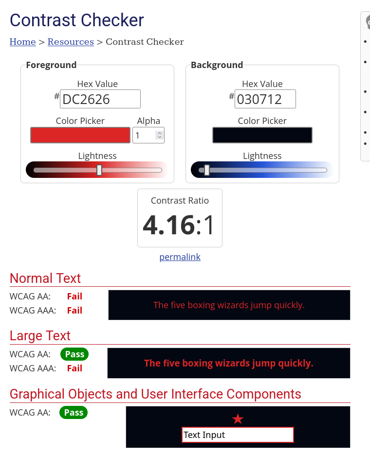
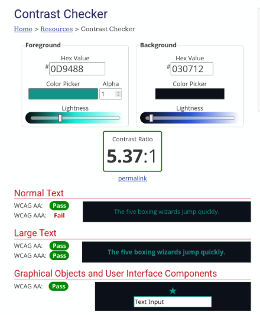
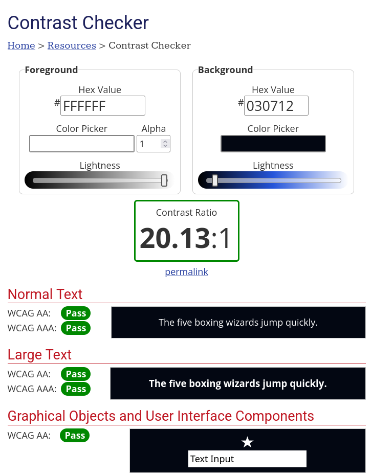

# Relatório de Avaliação de UI/UX e Acessibilidade

**Aplicativos Avaliados:** `apps/patient` e `apps/acs`  
**Referência Baseline:** PRD de Sistemas (Seção 4.3 — WCAG 2.1 Nível AA), `spec/ui_design.md`  
**Metodologia e Ferramentas:** WebAIM Contrast Checker, Auditoria Estática de Código (Dart AST/grep), Validação Prática via Android TalkBack em Dispositivo Físico USB e Especificação de Testes Remotos no UXtweak.

---

## 1. Comparativo com a Baseline WCAG 2.1 AA (Seção 4.3 do PRD)

| Critério WCAG 2.1 | Descrição do Critério | Requisito do PRD / Issue | Status | Resumo do Diagnóstico |
| :--- | :--- | :--- | :---: | :--- |
| **1.4.1 Color Use** | A cor não deve ser o único indicador visual de estado/risco | Duplo canal (Texto/Ícone + Cor) em sinais clínicos de risco | **Conforme** | Aplicado no paciente: rótulos explícitos `'Risco: Vermelho'`, `'Risco: Amarelo'` e `'Risco: Verde'` acompanhados de ícones. |
| **1.4.3 Contrast (Minimum)** | Razão de contraste min. de 4.5:1 (texto normal) e 3:1 (texto grande/UI) | ≥ 4.5:1 para texto sobre fundo escuro nos temas | **Não Conforme (Parcial)** | O vermelho (`#DC2626`) em texto atinge 4.16:1 sobre fundo `#030712`. O texto `Colors.white54` no Card da triagem atinge apenas ~3.2:1 (falha). |
| **2.4.7 Focus Visible** | Indicador claro de foco visual ao navegar por campos interativos | Foco visível em todos os elementos selecionáveis | **Conforme** | Testado via TalkBack em dispositivo Android: moldura de seleção envolve 100% dos elementos sem cortes visuais. |
| **2.5.5 Target Size** | Alvo de toque adequado para interatividade | ≥ 48x48 dp (padrão), ≥ 60x60 dp (botão de emergência/pânico) | **Conforme** | Botão de pânico mede `208x208 dp`. Botões de formulário e login medem `48x52 dp`. |
| **4.1.2 Name, Role, Value** | Árvore semântica exposta para leitores de tela nativos | Rótulos e papeis em 100% dos fluxos críticos | **Conforme** | Árvore semântica nativa do Flutter expõe abas (**Área, Fila, Mapa, Visita, Mais**) e formulários com clareza. |

---

## 2. Evidências Técnicas e Achados por Critério

### 2.1 Contraste e Uso de Cor (WCAG 1.4.3 e 1.4.1)

Auditoria realizada comparando as cores declaradas em `acs_theme.dart` e `patient_theme.dart` com as superfícies reais de renderização utilizando o WebAIM Contrast Checker:

#### Tabela de Razão de Contraste Renderizado

| Aplicativo | Par de Cores (Texto vs Fundo) | Contexto de Uso | Razão Real (WebAIM) | Exigência WCAG | Status |
| :--- | :--- | :--- | :---: | :---: | :---: |
| **Ambos** | Branco (`#FFFFFF`) / Background (`#030712`) | Texto principal / AppBar | **20.13:1** | 4.5:1 | Conforme |
| **ACS** | Amarelo (`#F59E0B`) / Background (`#030712`) | Risco Médio / Status | **9.37:1** | 4.5:1 | Conforme |
| **ACS** | Verde (`#10B981`) / Background (`#030712`) | Risco Baixo / Status | **7.93:1** | 4.5:1 | Conforme |
| **Paciente** | Teal Accent (`#0D9488`) / Background (`#030712`) | Elementos primários | **5.37:1** | 4.5:1 | Conforme |
| **Ambos** | Vermelho (`#DC2626`) / Background (`#030712`) | Alertas e textos críticos | **4.16:1** | 4.5:1 | Falha em Texto Normal |
| **Paciente** | Branco 54% opaco (`Colors.white54`) / Card (`#1E293B`) | Rodapé explicativo da triagem | **~3.2:1** | 4.5:1 | Falha (Texto pequeno) |

#### Evidências Visuais de Validação no WebAIM

  
*Figura 2.1: Teste de contraste entre a cor vermelha (#DC2626) e o fundo escuro (#030712) no WebAIM, indicando razão de 4.16:1 (Falha para Normal Text no WCAG AA).*

  
*Figura 2.2: Teste de contraste entre o tom Teal (#0D9488) e o fundo escuro (#030712) no WebAIM, aprovado com razão de 5.37:1.*

  
*Figura 2.3: Teste de contraste entre a cor branca (#FFFFFF) e o fundo escuro (#030712) no WebAIM, aprovado com razão de 20.13:1.*

#### Validação de Duplo Canal (WCAG 1.4.1)
No arquivo `apps/patient/lib/app/app.dart` (linhas 503-560), o componente `_TriageResult` utiliza rótulos de texto explícitos concatenados ao sinal visual: `'Risco: Vermelho'`, `'Risco: Amarelo'` e `'Risco: Verde'`.

---

### 2.2 Alvos de Toque (WCAG 2.5.5)

| App | Componente / Fluxo | Dimensão Renderizada | Mínimo Requerido | Status |
| :--- | :--- | :---: | :---: | :---: |
| **Paciente** | Botão de Emergência/Pânico (`panic_button`) | `208 x 208 dp` | 60 x 60 dp | Conforme (Amplo) |
| **Paciente** | Botões de Login e Envio de Triagem | `48 x 52 dp` | 48 x 48 dp | Conforme |
| **ACS** | Ações de Login, Confirmar Recebimento e Sincronizar | `48 x 52 dp` | 48 x 48 dp | Conforme |
| **ACS** | Ações de Emergência do SAMU ("Acionar/Ligar SAMU") | `48 x 52 dp` | 60 x 60 dp | Sugestão de Destaque |

---

### 2.3 Rótulos Semânticos e Navegação por Leitor de Tela (WCAG 4.1.2)

#### Inspeção Estática de Código
* **Instâncias de `Semantics()`:** Mapeadas nos fluxos de Login ACS (`app.dart:159`), Login Paciente (`app.dart:127`) e Botão de Pânico (`app.dart:327`).
* **Instâncias de `tooltip:`:** Mapeados em `apps/patient/lib/app/app.dart` nas linhas 606 (`'Enviar mensagem'`) e 696 (`'Novo alarme'`).

#### Teste Prático com Android TalkBack (Dispositivo Físico USB - ACS)
* **Navegação por Varredura nas Abas:** O leitor anunciou perfeitamente o nome e o papel semântico de todas as guias da barra inferior: **"Área"**, **"Fila"**, **"Mapa"**, **"Visita"** e **"Mais"** (ex: *"Mapa, guia 3 de 5, selecionado"*).
* **Fluxo de Visita e Formulários:** O motor semântico nativo do Flutter converteu os widgets `Text`, `Icon` e `IconButton` em elementos acessíveis sem interrupções.

---

### 2.4 Indicador de Foco Visível (WCAG 2.4.7)

* **Validação Prática:** Realizada via varredura com TalkBack habilitado em dispositivo Android físico conectado via USB no aplicativo ACS.
* **Resultado:** O indicador de foco nativo do sistema (moldura verde de destaque) acompanhou com precisão todos os alvos tocáveis, sem truncamento ou ocultação visual.

---

## 3. Matriz de Priorização de Achados e Sugestões de Ajustes

| Prioridade | Critério | Localização | Problema Identificado | Sugestão Concreta de UI / Código |
| :---: | :---: | :--- | :--- | :--- |
| **Alta** | 1.4.3 | `patient_app.dart` (linha 542) | `Colors.white54` sobre Card resulta em contraste de **~3.2:1** (falha WCAG AA para 12pt). | Substituir `color: Colors.white54` por `color: Colors.white70` ou `color: Color(0xFFE2E8F0)` (~5.2:1). |
| **Média** | 1.4.3 | `acs_theme.dart` e `patient_theme.dart` | Vermelho `danger` (`#DC2626`) como cor de texto sobre fundo escuro resulta em **4.16:1**. | Ajustar a constante da cor de perigo para `Color(0xFFEF4444)` (eleva a razão de contraste para **~5.7:1**). |
| **Média** | 2.5.5 | `apps/acs/lib/app/app.dart` | Botões de acionamento crítico do SAMU usam tamanho padrão (`48x52 dp`). | Aplicar `minSize` estendido de `60x60 dp` nas ações do SAMU para corresponder ao padrão tátil de emergência. |
| **Baixa** | 4.1.2 | `apps/acs/lib/app/app.dart` | Cartões de pacientes e badges de risco dependem da árvore automática. | Envolver os cartões do dashboard em widgets `Semantics(label: "Paciente X, Risco Vermelho Alto", ...)` explícitos. |

---

## 4. Planejamento de Testes de Usabilidade Remota (UXtweak)

Para complementar a auditoria técnica de acessibilidade com testes de fricção de UX com usuários reais, foram estruturados os seguintes cenários no **UXtweak**:

### Cenário 1: Disparo de Alerta de Urgência (App Paciente)
* **Objetivo:** Avaliar o tempo de reação e a taxa de sucesso no acionamento do botão de pânico.
* **Métrica:** Tempo até o primeiro clique (*First-Click*) e taxa de conclusão sem erros.
* **Instrução dada ao usuário:** *"Você está se sentindo mal e precisa acionar o atendimento de emergência imediatamente. Qual botão você pressiona?"*

### Cenário 2: Priorização na Fila de Atendimento (App ACS)
* **Objetivo:** Avaliar a clareza da visualização dos sinais de risco em ambiente com baixo ruído visual.
* **Métrica:** Taxa de cliques corretos no paciente de maior risco da lista.
* **Instrução dada ao usuário:** *"No seu painel de atendimento, identifique o paciente que exige visita prioritária imediata e acesse os detalhes dele."*
